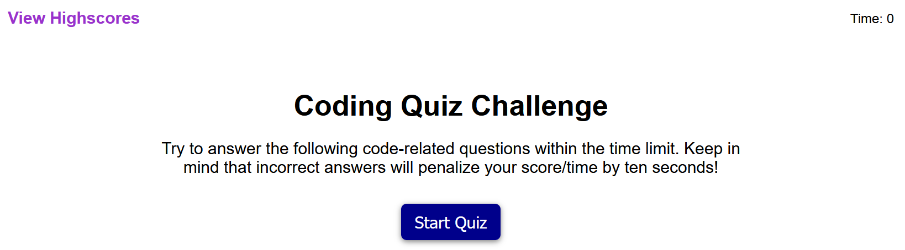

# Timed Coding Quiz

## Description
A timed quiz that keeps track of your score. Makes you lose 10 secondds
everytime you get a question wrong, and also saves your final score
to a list of all your other attempts next to the initials of your choosing. 
Similar to an arcade.

To start the quiz and the timer, click the "Start Quiz" button. You will
be give 75 seconds.

Good luck!

## Made With
* HTML
* CSS
* JavaScript

## Website
https://chance-crawford.github.io/TimedQuiz/